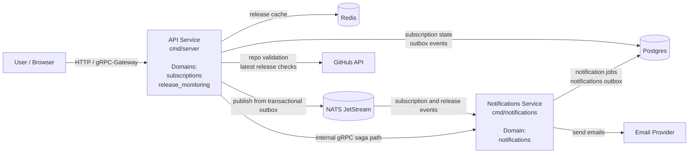
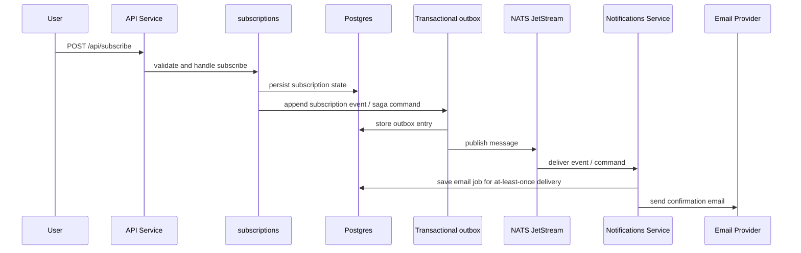
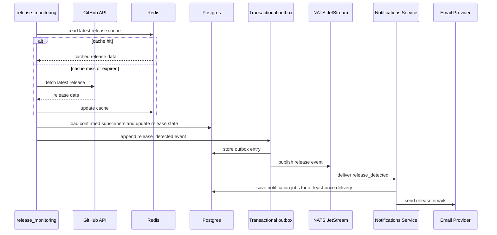

# GitHub Release Notifications System

This project is a Go-based system for subscribing users to GitHub repository release notifications. It is organized around bounded contexts rather than technical layers alone, and it currently runs as two cooperating services: a public-facing API service and a dedicated notifications service.

The business domains are `subscriptions`, `release_monitoring`, and `notifications`. Supporting concerns such as transport, persistence infrastructure, event delivery, and third-party adapters live in shared layers under `internal/platform`, `internal/contracts`, and `internal/integrations`.

This is not a strict or pure DDD implementation. The codebase uses bounded contexts and explicit domain ownership, but keeps pragmatic technical layers such as `app`, `postgres`, `grpc`, and `worker` inside each context. That tradeoff fits this system well: it has relatively little dense domain logic, while much of the real complexity sits in service boundaries, asynchronous workflows, inter-service communication, and reliability guarantees.

## What the System Does

- Accepts subscriptions for GitHub repositories in `owner/repo` format.
- Lets users confirm subscriptions through email links.
- Lists a user's current subscriptions.
- Allows link-based unsubscribe without login.
- Polls GitHub for new releases on confirmed repositories.
- Sends confirmation and release emails asynchronously.

## Architecture at a Glance

The canonical maintained architecture source lives in [docs/final.arch.puml](docs/final.arch.puml). The rendered SVG is available at [docs/final.arch.svg](docs/final.arch.svg). The inline diagram below is a reader-friendly summary of that same current structure.



The main service boundary is asynchronous. The API service owns subscription state and release detection, then publishes domain events through a transactional outbox into NATS JetStream. The notifications service consumes those events, creates durable notification jobs, and isolates email-provider latency and failure from the public API path. The direct gRPC link is only used for the confirmation-email saga path when that transport is configured.

## How the Application Is Split

### Bounded Contexts

#### `subscriptions`

Owns the subscription lifecycle. This context validates input, persists subscriptions, handles confirmation and unsubscribe flows, lists subscriptions, and initiates confirmation-email delivery.

#### `release_monitoring`

Owns GitHub release detection for confirmed repositories. This context polls GitHub, decides whether a release is new for current subscribers, updates release-tracking state, and emits release-detected events.

#### `notifications`

Owns email-oriented reactions to domain activity. This context consumes subscription and release events, creates durable email jobs, and sends confirmation and release emails through the configured provider.

### Shared Supporting Layers

#### `internal/platform`

Technical infrastructure only: config loading, logging, metrics, Postgres and Redis clients, NATS JetStream integration, transactional outbox, HTTP middleware, and event helpers.

#### `internal/contracts`

Cross-context and cross-service contracts: shared event metadata, domain event payloads, command/reply messages for the confirmation saga, and mail abstractions.

#### `internal/integrations`

Adapters to external systems such as GitHub and Resend.

Business rules live inside the bounded contexts. Transport, broker, storage, and vendor-specific concerns live in the supporting layers and adapters.

## Layering Inside Each Domain

The codebase repeats a stable package pattern across contexts. Not every context uses every layer, but the meaning of each folder stays consistent.

- `domain`: core business concepts and state shapes.
- `app`: use cases and application orchestration.
- `postgres`: persistence adapters and transaction-aware repositories.
- `grpc`: transport adapters for public or internal gRPC APIs.
- `worker`: long-running background processing loops.
- `notify` in `subscriptions`: outbound event and saga publishing helpers.

In practice, this means the domain packages define the business model, the app layer coordinates workflows, and the outer layers talk to databases, brokers, HTTP/gRPC transports, or external providers.

## Service Responsibilities

### API Service: `cmd/server`

The API service hosts the public HTTP and gRPC surface, runs subscription use cases, runs the GitHub release scanner, persists outbox events, and dispatches those events to NATS JetStream. It contains the `subscriptions` and `release_monitoring` bounded contexts.

### Notifications Service: `cmd/notifications`

The notifications service consumes subscription and release events from NATS JetStream, stores notification jobs, runs sender and cleanup workers, and exposes an internal gRPC API for the confirmation-email saga path. It contains the `notifications` bounded context.

Both services live in the same Go module and currently share one Postgres database, but they are separated by runtime process and business responsibility.

## Infrastructure and Observability

The local runtime stack is not just the two application services. The default Compose setup also brings up Postgres, Redis, NATS JetStream, and an observability stack for logs and metrics.

### Logs: Filebeat -> Elasticsearch -> Kibana

Application services write structured JSON logs to stdout. Containers that should be collected are labeled with `co.elastic.logs/enabled=true`, and Filebeat uses Docker autodiscovery to pick them up, attach Docker metadata, decode the JSON payload, and ship the resulting events into Elasticsearch daily indices.

The idea behind this pipeline is to keep application code simple, make logs queryable as structured fields rather than raw text, and provide a ready-made UI for searching and filtering operational events in Kibana.

### Metrics: Prometheus -> Grafana

The API service exposes Prometheus-format metrics at `/metrics`. Prometheus scrapes that endpoint on a fixed interval, stores the time-series locally, and Grafana is pre-provisioned to use Prometheus as its datasource together with a dashboard from `deploy/observability/grafana/`.

The metric set follows RED-style monitoring for the HTTP surface: request rate, error rate, and request duration. The stack also exposes service-specific operational metrics such as outbox backlog and GitHub availability/rate-limit state, so the dashboards combine standard API health signals with architecture-specific pipeline signals.

## Event and Data Flow

### Subscribe Flow



### Release Flow



## Repository Map

- `cmd/server`: public API service entrypoint and wiring.
- `cmd/notifications`: notifications service entrypoint and wiring.
- `internal/subscriptions`: subscription lifecycle domain.
- `internal/release_monitoring`: release scanning domain.
- `internal/notifications`: notification job creation and delivery domain.
- `internal/platform`: shared infrastructure and technical building blocks.
- `internal/contracts`: shared event, command, reply, and mail contracts.
- `internal/integrations`: third-party adapters such as GitHub and Resend.
- `proto/`: protobuf contracts for public and internal gRPC APIs.
- `docs/adr/`: architecture decisions and design evolution.

## Quick Start

Prerequisites: Go, Docker, and the environment variables from `.env.example`.

```bash
make setup
make generate
cp .env.example .env
docker compose up --build
```

Default local endpoints:

- API HTTP: `http://localhost:8080`
- API gRPC: `localhost:9090`
- Notifications internal gRPC: `localhost:9092` mapped to service port `9091`
- Prometheus: `http://localhost:9091`
- Grafana: `http://localhost:3000`
- Kibana: `http://localhost:5601`

## Testing and Further Reading

Core local commands:

```bash
make test-unit
make test-unit-strict
make test-integration
make test-e2e
```

Additional references:

- [testing.md](testing.md)
- [System design](docs/initial-system-design.md)
- [ADR 002: Email delivery guarantees](docs/adr/002-email-delivery-guarantees.md)
- [ADR 006: Message broker selection for API-to-notifications events](docs/adr/006-message-broker-selection-for-service-events.md)
